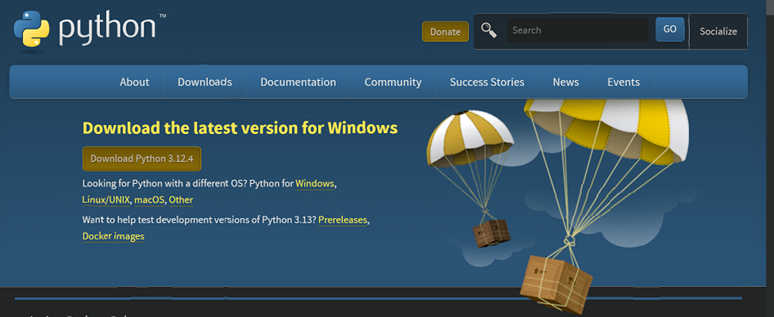

# Dev_Setup
Setup Development Environment

#Assignment: Setting Up Your Developer Environment

#Objective:
This assignment aims to familiarize you with the tools and configurations necessary to set up an efficient developer environment for software engineering projects. Completing this assignment will give you the skills required to set up a robust and productive workspace conducive to coding, debugging, version control, and collaboration.

#Tasks:

1. Select Your Operating System (OS):
   Choose an operating system that best suits your preferences and project requirements. Download and Install Windows 11. https://www.microsoft.com/software-download/windows11

HOW TO INSTALL WINDOWS 11 ON YOUR OPERATING SYSTEM
Windows 11 is an operating system that has been developed by windows to be able to be applied to all computers for more improved functionality and performance in terms of operation.
The following are the steps of downloading installing and configuring the Windows 11 operating system:
•	Go to the official windows website
•	Go to the software downloads tab 
•	Go to the Windows 11 downloads section
•	Go to “Download Windows II Disk Image”
•	Select “Windows II multi-edition 150 for x64devices”
•	Check Windows PC Health Check Setup

•	Download it and run it or if you are using a USB, install the flash drive and begin the download process.
•	Conduct the test to show if  your device is compatible with Windows 11
•	Check to see all green ticks
•	Close the window
•	Install the software- Ensure that you have enough space on your drive as the file is a 6.3GB file
•	After installation, configure the operating software by selecting your region and license terms.
•	You can also personalize your accounts by signing in to Microsoft or creating a new account and configure the customer privacy settings.
•	Run your operating system which will require to restart the laptop after doing so.

2. Install a Text Editor or Integrated Development Environment (IDE):
   Select and install a text editor or IDE suitable for your programming languages and workflow. Download and Install Visual Studio Code. https://code.visualstudio.com/Download

HOW TO DOWNLOAD AND INSTALL VISUAL STUDIO CODE
Visual studio code is a software that is used to be able to be used to analyze code for an individual who wants to code. This is to mean that Visual Studio Code will analyze if a code is written correctly and it will identify errors and provide solutions. The following are the steps needed to do so: 
•	Go to your browser

•	Search Visual Studio Code
•	Choose first link and go to the download section
•	Select the device that you are using, i.e. , Windows, Mac
•	Selects the second folder as the first is a lite file
•	Click download 
•	Open downloads

•	Run the download
•	Accept the license agreement 
•	Choose installation location- mine was downloads
•	Select to have desktop icon 
•	Click install
•	Run the app

3. Set Up Version Control System:
   Install Git and configure it on your local machine. Create a GitHub account for hosting your repositories. Initialize a Git repository for your project and make your first commit. https://github.com

   HOW TO INITIALIZE A GIT REPOSITORY FOR YOUR PROJECT AND MAKE YOUR FIRST COMMIT
A Git repository can be defined as a repository that can be used to be able to store all of your projects that have been edited in the Visual Studio Code and other places. It ensures that the code developed in the visual studio code is not lost.
In order to be able to connect our Git repository and your Git bash account, one has to have downloaded git bash. Git bash is downloaded through the following process:
•	Install Git Bash from www.git-scm.com

•	Run the installed app
•	Select in the Branching section Let Git decide
•	Select git from the command line 
•	Select Bundled Open SSH
•	Select default library
•	Select checkout windows style
•	Select use MinTTY
•	Select fast forward or merge
•	Install and run

After installing GitBash, run the following commands in the following steps:
•	git –version- gives details of the version
•	git config --global --list- shows everyone who has accessed github global users
•	git config --help
•	git
•	git -- help
•	git config -- global user.name “Benjamin Mutinda”
•	git config -- global user.email benjamutish123@gmail.com
•	git config -- global –list

One has to link the message that will be in the repository to the account at Github. This is done through the following steps:
•	Go to Git Bash
•	mkdir GitSession
•	cd GitSession
•	vim hello_git.py
•	vim READ.md

•	Press I to insert
•	Edit Text- This is my first Git session for introduction
•	Press ESC
•	It will take you to the bottom space 
•	Write :wq

In order to initialize a git repository for your project and make your first commit, there has to be the creation of a repository. This repository is created in the following way:
•	Open Git hub
•	Go to the icon on the far right and click it 
•	Go to new repository 
•	Name your repository the way you want it to appear 

•	Choose whether the repository should be public or private
•	Scroll down and create the repository

After creating the directory, the repository has to be initialized and a commit to be made. This is done through the following steps:
•	Go to GitBash
•	git init
•	git. add
•	git commit –m “Filename”
•	Copy link from command line in the repository 
•	git push –u origin master “link copied”
•	Go to github and check

4. Install Necessary Programming Languages and Runtimes:
  Instal Python from http://wwww.python.org programming language required for your project and install their respective compilers, interpreters, or runtimes. Ensure you have the necessary tools to build and execute your code.

  HOW TO INSTALL PYTHON AS A NECCESARY PROGRAMMING LANGUAGE
Python is a language that is used in programming that is able to undertake certain functions in the process of coding. The installation process of python includes the following:
•	Go to python.org
•	Go to downloads
•	Select download for windows
•	Latest version- python 3.12.3

•	Download

To verify that python has installed, follow the following steps:
•	Go to Windows Powershell
•	Enter code 
•	python --version
It should show the python version.

5. Install Package Managers:
   If applicable, install package managers like pip (Python).

   HOW TO DOWNLOAD AND INSTALL PACKAGE MANAGERS LIKE PIP (PYTHON).
This is done to be able to download extensions needed in python without going to the web browser. 
The code for it “python –m pip install virtualenv”

6. Configure a Database (MySQL):
   Download and install MySQL database. https://dev.mysql.com/downloads/windows/installer/5.7.html

   HOW TO DOWNLOAD AND INSTALL MYSQL DATABASE.
My SQL is a database that is required for every coder to use. It is downloaded and installed in the following steps:
•	Go to kb/install-mysql-on-windows
•	Choose the 8 version
•	Choose to install for windows

•	Install 
•	Go to downloads 
•	Open it from there
•	It will download as a zip file 
•	Download 7zip
•	Use it to unzip the zipped folder
•	At the first interface- choose server only
•	At the type and network- choose development computer 
•	Click show advanced and logging options
•	Click next
•	Create a strong password
•	Click first option on windows service
•	At Advanced options make sure the server ID is 1
•	Apply configurations 

•	Click all options and execute

In order to check if it has installed you open it from the area where it is located and enter your password to confirm.

7. Set Up Development Environments and Virtualization (Optional):
   Consider using virtualization tools like Docker or virtual machines to isolate project dependencies and ensure consistent environments across different machines.

   HOW TO SET UP DEVELOPMENT ENVIRONMENTS AND VIRTUALIZATION 
Setting up development environments and using virtualization tools or virtual machines can help manage dependencies and ensure consistent environments across different machines. It is done through the following steps:
•	Install virtual environment
•	Create virtual environment
•	Activate virtual environment 
•	Install Dependencies
•	Deactivate 

8. Explore Extensions and Plugins:
   Explore available extensions, plugins, and add-ons for your chosen text editor or IDE to enhance functionality, such as syntax highlighting, linting, code formatting, and version control integration.

   HOW TO EXPLORE EXTENSIONS AND PLUGINS
Extensions are the various programs that are programmed in Visual Studio Code that are used to be able to debug coded language within the visual studio code.
To access it:
•	Open Visual studio Code
•	Locate on the Right navigation pane
•	Find Extensions
•	Download the necessary extensions needed

CHALLENGES FACED DURING THE SETUP PHASE AND STEPS TO OVERCOME THEM
The first challenge that I faced was the challenge of having to re-install softwares after i have installed them from the website. This occurred due to insufficient space in the hard drive and i overcame this obstacle by deleting unwanted items in order to make space for it.

The second challenge was the challenge of configuring the software after installations. Some of the softwares after installation have to be configured in a certain way in order to make it function properly. I overcame this obstacle through using class notes and recordings as well as online tutorials which helped me set up the software perfectly.

9. Document Your Setup:
    Create a comprehensive document outlining the steps you've taken to set up your developer environment. Include any configurations, customizations, or troubleshooting steps encountered during the process. 

#Deliverables:
- Document detailing the setup process with step-by-step instructions and screenshots where necessary.
- A GitHub repository containing a sample project initialized with Git and any necessary configuration files (e.g., .gitignore).
- A reflection on the challenges faced during setup and strategies employed to overcome them.

#Submission:
Submit your document and GitHub repository link through the designated platform or email to the instructor by the specified deadline.

#Evaluation Criteria:**
- Completeness and accuracy of setup documentation.
- Effectiveness of version control implementation.
- Appropriateness of tools selected for the project requirements.
- Clarity of reflection on challenges and solutions encountered.
- Adherence to submission guidelines and deadlines.

Note: Feel free to reach out for clarification or assistance with any aspect of the assignment.
